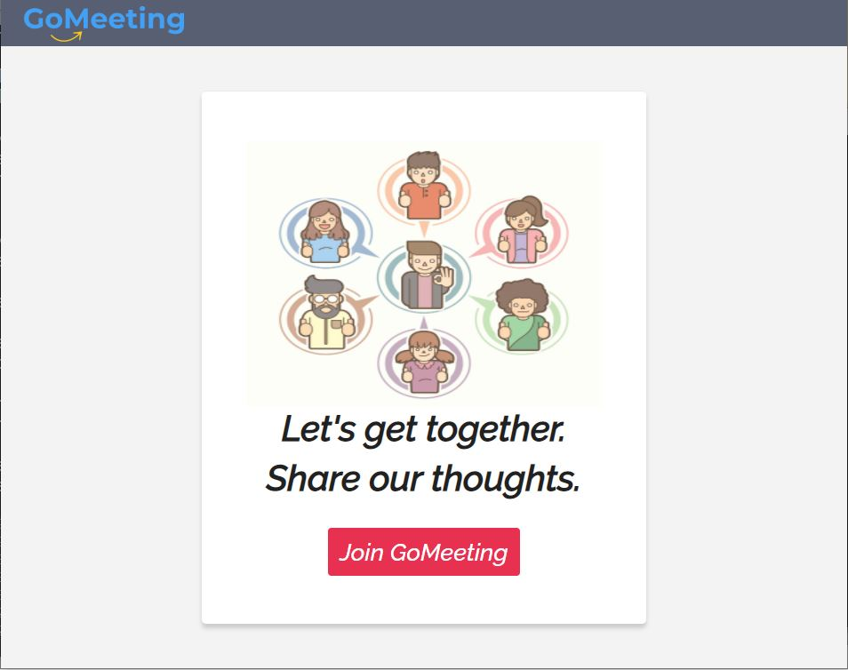
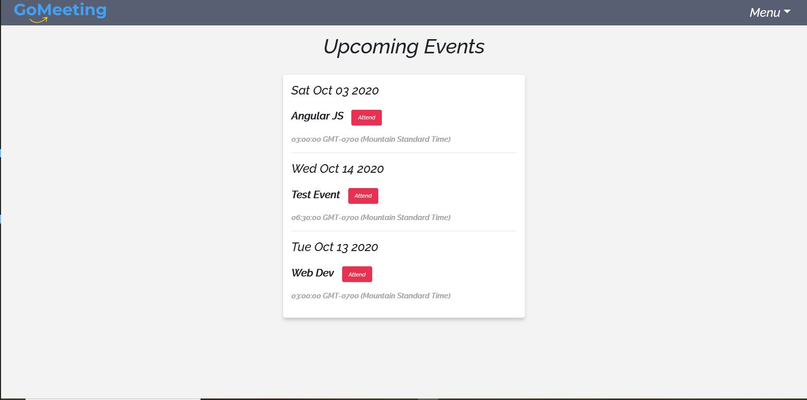

# GoMeeting

<h1><a href="https://go-meeting.herokuapp.com/" target="_blank">Go Meeting Deployed</a></h1>

<h2>Demo Accounts</h2>

- guest@gmail.com(pass:go@123456)
- test@gmail.com(pass:go@123456)

Go Meeting: Web app built using Express js and React Platform. It's used to organize online groups that host in-person events for people with similar interests. The primary purpose of making this application is to use the technology and skills I've learned recently and applied them to a real project to get some hands-on experience.

<h2>Usage</h2>

1. The login or signup in the landing page by clicking on 'Join GoMeeting'

2. The user get redirected to Auth0 login page for authentication

3. After the loggin successfully, the user will sent the home page, where the user can browse the upcoming events scheduled by other users/hosts

4. Clicking attend button, will add the event to the user's booked Events list, and from this list, the user can cancel his booking.

5. The use can host/schedule his own event by going to Hosted Events page, also he/she can cancel the hosted event or check who booked his events

   Note: if the user/host cancel his event, the event will be deleted from the booked page for each user signed up to attend this event.

<h2>Video Demo</h2>

<video src="Readme/GoMeeting.mp4" width="320" height="200" controls preload></video>

